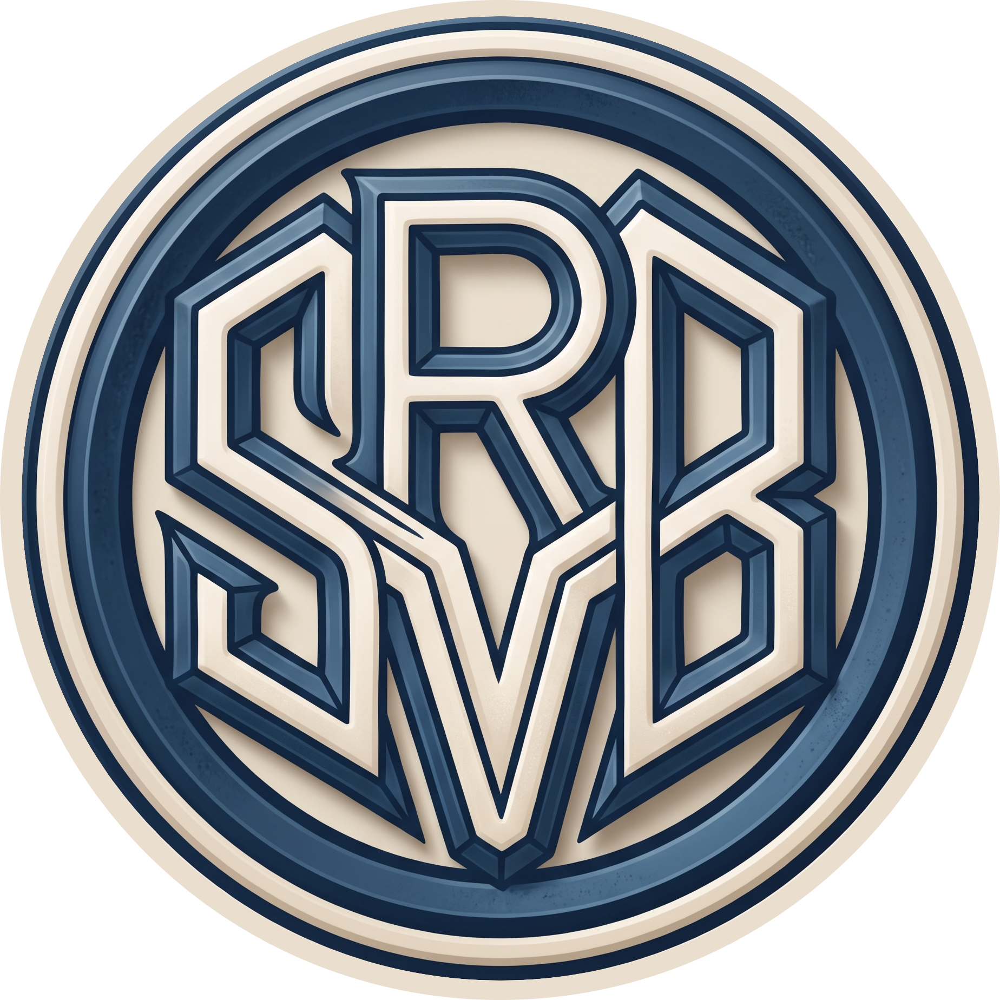

# SRVB OS

<p align="center">
  
</p>

<p align="center">
  Ein Fedora-bootc-Image mit Hyprland und Noctalia.
</p>

## Überblick

SRVB OS ist ein unveränderliches Desktop-Linux auf Basis von Fedora bootc. Das
System kombiniert den tiling Wayland-Compositor Hyprland mit der Noctalia
Desktop-Shell und einem schlanken, vorkonfigurierten Arbeitsbereich.

Das Image wird als OCI-Container gebaut und kann direkt mit `bootc` installiert
oder aktualisiert werden.

## Enthalten

- Fedora bootc als Basis
- Hyprland als Wayland-Compositor
- Noctalia Shell und Noctalia Greeter
- greetd für die Anmeldung
- PipeWire und WirePlumber für Audio
- NetworkManager, Bluetooth, fwupd und Power Profiles
- NVIDIA-Unterstützung über die vorbereiteten Kernel- und Dracut-Konfigurationen
- Vorinstallierte Flatpak-Anbindung mit Flathub
- SRVB Plymouth-Boot-Splash mit `logo.png`
- Standardkonfigurationen für Hyprland und Noctalia in `/etc/skel`

## Image

Das veröffentlichte Image ist:

```text
ghcr.io/srvb/srvb-os:latest
```

Die Images werden durch GitHub Actions gebaut und in die GitHub Container
Registry veröffentlicht. Signierte Images werden mit Cosign erstellt.

## Installation und Update

Auf einem bestehenden bootc-System kann das Image mit folgendem Befehl
installiert werden:

```bash
sudo bootc switch ghcr.io/srvb/srvb-os:latest
sudo systemctl reboot
```

Für spätere Updates genügt:

```bash
sudo bootc upgrade
```

Vor einem Wechsel sollte ein Backup wichtiger Daten vorhanden sein. Das Image
ist für eine Neuinstallation oder den Wechsel von einem kompatiblen Fedora-
Atomic/bootc-System gedacht.

## Lizenz

Die Dateien dieses Projekts stehen, sofern nicht anders angegeben, unter der
Apache License 2.0. Der vollständige Lizenztext befindet sich in
[LICENSE](LICENSE).

Die im Image enthaltenen Komponenten und Pakete stammen von Drittanbietern und
unterliegen ihren jeweiligen Lizenzen. Für diese gelten die Lizenz- und
Urheberrechtshinweise der jeweiligen Projekte und Pakete.